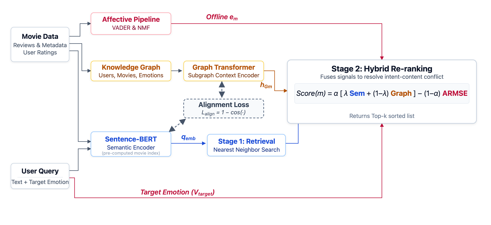

# Knowledge-graph Retrieval with Affective Grounding (KRAG)

KRAG is a retrieval framework for resolving **intent-content conflict**: situations where a user asks for something that is semantically relevant to one topic but emotionally aligned with another. The implementation in this repository studies that problem through an affective recommendation setting, where users provide both a natural-language query and a target emotion profile.

## Status

This repository is a public research snapshot of the current KRAG implementation and will continue to evolve as the paper, reproducibility workflow, and external-facing assets are finalized.

## Problem

Most retrieval systems optimize for topical relevance. That works when user intent is close to content semantics, but it breaks down when those two are in tension.

Examples:

- a user wants a **hopeful** film about war
- a user wants something **cathartic** rather than merely sad
- a user wants recommendations that can be explained in terms of both topic and emotional fit

In these cases, relevance-only retrieval can return content that is topically correct but misaligned with the user’s actual intent.

KRAG addresses that gap by treating the user’s target emotional state as an explicit retrieval signal rather than a secondary filter or post-hoc annotation.

## What This Repository Delivers

This codebase implements:

- a heterogeneous knowledge graph over users, movies, and emotions
- a graph transformer encoder for subgraph-level structural representations
- a hybrid scoring function that combines semantic similarity, graph structure, and affective displacement
- experiment pipelines for comparative retrieval, alignment sweeps, structural sensitivity, and explainability analysis
- optional LLM-backed response generation

The central idea is to separate three things that are often conflated:

- what the content is about
- how the content is connected structurally
- how the content is likely to affect the user

## Project Summary

The affective domain is used here as a controlled testbed for intent-content conflict. Users specify a target emotional state as a structured six-dimensional vector, and the system retrieves candidates that balance semantic match with emotional fit. Emotions are represented as first-class graph nodes, connected to content through weighted affective edges. A graph transformer encodes local subgraph context, and an explicit alignment objective anchors graph representations to the text embedding space so the two signals can be fused at ranking time.

This gives the system a way to reason about cases where user intent is not recoverable from semantics alone. It also makes the ranking function more inspectable: the final score can be broken down into semantic, graph, and affective terms instead of relying on a single opaque similarity number.

## Architecture

The architecture used in the current paper/repository snapshot is shown below.



At a high level:

1. movie metadata and user signals are converted into semantic and affective representations
2. a heterogeneous knowledge graph connects users, movies, and emotions
3. semantic retrieval generates the initial candidate set
4. a graph transformer produces subgraph-aware structural embeddings
5. candidates are re-ranked using a hybrid scoring function that explicitly trades off relevance and intent alignment

## Scoring

The current retrieval logic uses a nested score:

\[
\text{Score} = \alpha \cdot [\lambda \cdot \text{Semantic} + (1-\lambda) \cdot \text{Graph}] - (1-\alpha) \cdot \text{AffectiveRMSE}
\]

Where:

- `Semantic` is the text-space match between query and candidate
- `Graph` is the similarity between the query representation and the candidate subgraph representation
- `AffectiveRMSE` is the normalized distance between the user’s target emotion vector and the candidate’s affective signature

This makes the relevance-intent trade-off explicit and tunable.

Implementation reference: `src/krag/retrieval/krag_retriever.py`

## Results Snapshot

The figures below summarize the current experimental outcomes from the internal evaluation pipeline.

### 1. Alignment matters

The graph encoder is explicitly aligned to the text embedding space before fusion. In the current alignment sweep:

- the best recorded alignment weight is **0.3**
- the best validation loss is **0.0140**
- the corresponding validation cosine reaches **0.9518**

### 2. KRAG improves affective fit under conflict

In the comparative retrieval analysis:

- under **agreement** conditions, `KRAG (a=0.3)` reaches **AP@5 = 0.7330** and **ADE = 0.2629**
- under **dissonance** conditions, `KRAG (a=0.3)` reaches **AP@5 = 0.4723** and **ADE = 0.3467**
- in the same dissonance setting, `KRAG (a=1.0)` has **ADE = 0.3837**, showing the cost of removing the affective penalty

### 3. Structural depth is stable after alignment

In the `k`-sweep over 1 to 5 hops:

- `NDCG@10` stays within a narrow band of roughly **0.839 to 0.840**
- `AP@5` stays around **0.734**
- mean knowledge score stays near **0.795 to 0.798**

This indicates that the aligned encoder produces a stable graph signal across subgraph depths in the current setup.

### 4. Explainability is not only descriptive

Perturbation-based explainability analysis shows:

- `KRAG (a=0.5)` reaches mean FNS of **0.1254** on agreement queries and **0.1618** on dissonance queries
- `KRAG (a=0.3)` reaches mean FNS of **0.0570** on agreement queries and **0.1329** on dissonance queries

- full-profile perturbation yields overall mean FNS of **0.1530** for `KRAG (a=0.5)` on agreement queries
- and **0.1566** for `KRAG (a=0.5)` on dissonance queries

These artifacts are included to show that the graph signal is not only useful for ranking, but also causally relevant to ranking behavior under perturbation.

## Repository Structure

```text
.
├── colab_generate_embeddings.py
├── colab_train_and_experiment.py
├── notebooks/
├── run_experiments.py
├── src/
│   └── krag/
│       ├── cloud/
│       ├── core/
│       ├── data/
│       ├── evaluation/
│       ├── experiments/
│       ├── llm/
│       ├── retrieval/
│       ├── storage/
│       ├── training/
│       └── system.py
```

Key entrypoints:

- `run_experiments.py`: main experiment driver for the paper-style evaluation pipeline
- `colab_generate_embeddings.py`: GPU-oriented embedding generation workflow
- `colab_train_and_experiment.py`: Colab workflow for training and running experiments

## Data and Reproducibility Scope

The code expects externally provisioned data and precomputed artifacts. The current repository snapshot does not publish the raw/core dataset.

What is available here:

- code for ingestion, graph construction, training, retrieval, and evaluation
- expected dataset path definitions in `src/krag/data/adapters.py`
- expected column definitions in `src/krag/data/schema.py`
- summary-level documentation of the current delivered results

What is not available here yet:

- the underlying source data
- the full paper workspace
- a turnkey public reproduction package for all experiments

## Running The Code

### Environment

Recommended:

- Python 3.10+
- a virtual environment
- access to the external data/artifact storage used by the loaders

Install dependencies:

```bash
python -m venv .venv
source .venv/bin/activate
pip install -r requirements.txt
```

### Experiment driver

```bash
python run_experiments.py --experiment comparative
python run_experiments.py --experiment sensitivity
python run_experiments.py --experiment causal
```

## Notebooks

The notebooks in this repository are intended to document paper-relevant workflows only. Temporary or internal notebooks are not part of the public surface.

Where included, notebooks are meant to help readers inspect:

- training workflows
- comparative retrieval evaluation
- structural sensitivity analysis
- explainability / faithfulness evaluation

## Technology Stack

- PyTorch
- PyTorch Geometric
- Sentence Transformers
- ChromaDB
- NetworkX
- optional Vertex AI integration for response generation and judge-style evaluation

## Why This Matters

This project is relevant anywhere a system needs to retrieve content that is not only topically relevant, but also aligned with a structured user intent that may conflict with topic semantics.

Possible application areas include:

- entertainment recommendation
- mood-aware search
- explainable content discovery
- retrieval systems where user satisfaction depends on more than lexical or semantic similarity alone

## Notes

- The repository is being prepared as a clean public snapshot of the current KRAG implementation.
- Raw/core data and paper workspace assets are not included.
- Documentation will continue to improve as more of the workflow is externalized for reproducible use.
